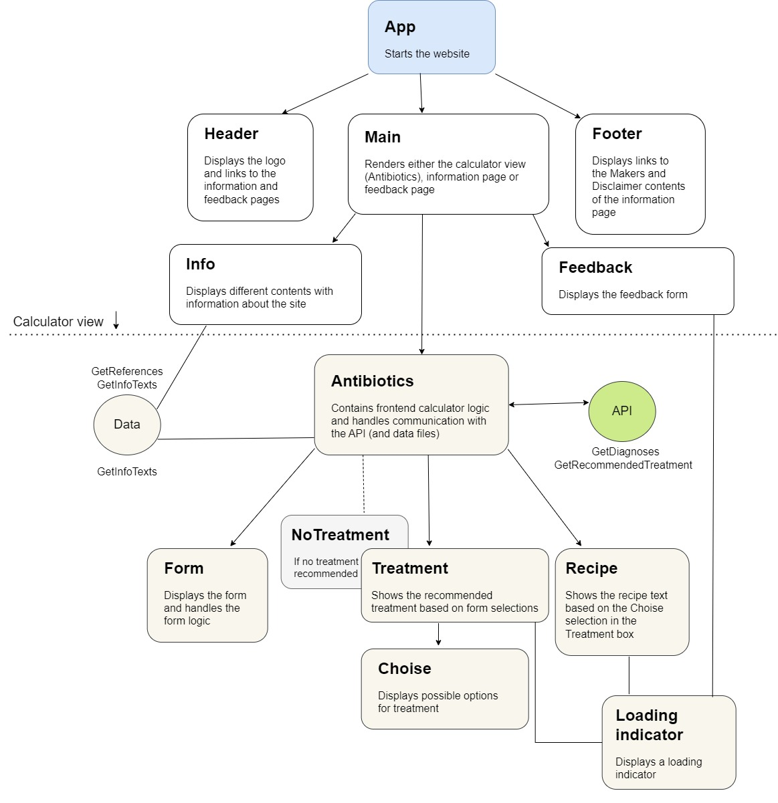

# Frontend - Antibiootit

## Requirements

- Node.js 16.16.0
- npm 9.2.0

https://docs.npmjs.com/downloading-and-installing-node-js-and-npm

## Run in development mode

This section describes how to run the frontend locally. The development server consumes more resources, but provides more functionalities for development.
### Environment

The development mode uses production (Railway) backend server for API calls. It requires valid `API-KEY` for the calls. Here are instructions how to set it up.

`.env` file is required in the root directory. The content should be:

```
REACT_APP_API_KEY=<API-KEY>
```
The value for `<API-KEY>` should be the same as hosting service's backend server's `apikey` environment variable. It can be found from Railway.

### Running the program

To run the app in the development mode, enter the following commands in the root directory:

```
npm install
npm run dev
```
Open http://localhost:3000 to view it in your browser.

## Run in production mode

This section describes how to run the program in production mode with optimized server and less memory consumption.

### Environment
In production mode, `PORT` environment variable needs to be set. Railway hosting service provides this automatically.

`REACT_APP_API_KEY` environment variable needs to be set. It must match Railway's backend server's `apikey` environment variable. 

### Running the program
To run the app in production mode, enter the following commands in the root directory:
```
npm run build
npm run start
```

## Deploying to Railway
CI/CD-pipeline has been set up to deploy changes in `main` branch automatically to Railway. It automatically fetches the codes, builds the new production server and deploys it automatically. Deployed application is reachable from [antibiootit.fi](antibiootit.fi) or [via Railway's domain](frontend-production-a67f.up.railway.app)

## The frontend component structure



Our web application follows a frontend component structure that originates from App.js, which hosts the Header, Main, and Footer components. Depending on the path, the Main component's content changes (see Routing).

### Routing
The routing in the web application has been implemented using React Router. The routes are implemented in the App.js file, with routes to the main (calculator) view, the information page, and feedback page.

Links to each of these routes are in the Header component which serves as the navigation bar. The Footer also has links to the information page.
### Calculator (Laskuri)
The calculator view is the first view on the website, and along with the actual calculator there’s an aside element containing some basic information about the site.

The calculator is made up of several components. The component that handles the logic and the communication with the API is called Antibiotics.

The Antibiotics component renders the Form, and after the user has submitted the form, the Treatment (or NoTreatment) component is rendered. The Treatment component uses the Choise component to display the possible treatment options. Along with the Treatment component, the Recipe component is also rendered. It shows the selected treatment and the dosage instructions that can be copied to a recipe.
### Information page (Tietoa sivustosta)
The information page has four links to different page contents. The default page is Tausta ja tavoitteet (Background and purpose). The other links are Tekijät (Makers), Vastuuvapauslauseke (Disclaimer), and Tietosuojaseloste (Privacy policy). 
### Feedback page (Palaute)
The feedback page contains an embedded Google Forms questionnaire.
### Style
All the website’s styling is in style.css.
